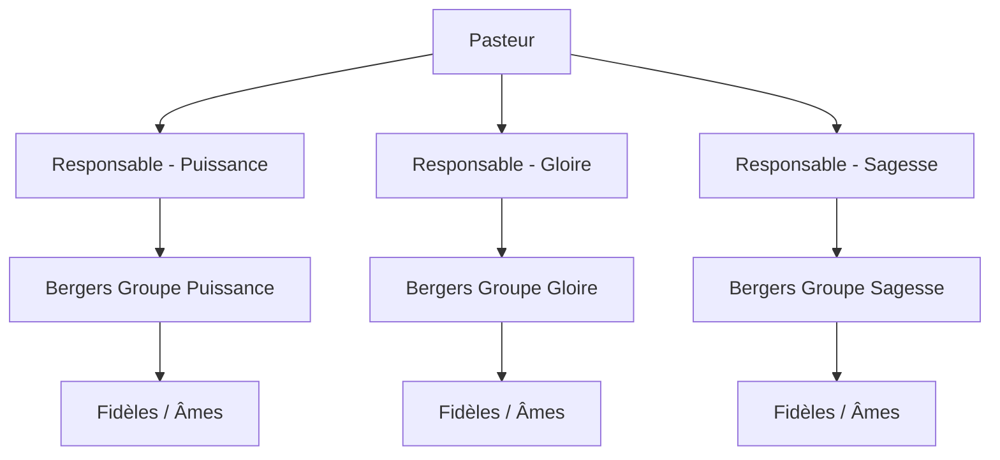

# Conception du Système de Gestion d'Église (Church Management System)

**Date :** 4 Juillet 2026  
**Objectif :** Concevoir une application web responsive permettant le suivi spirituel et administratif des fidèles (âmes) par les bergers, la supervision des bergers par les responsables de groupe, et la vue globale de l'œuvre par le pasteur.

---

## 1. Architecture des Rôles & Hiérarchie

L'église est organisée selon une hiérarchie pyramidale claire et structurée à quatre niveaux :



1. **Pasteur :** Accès global en lecture à toutes les données de l'église (bergers, responsables, fidèles, présences, rapports, alertes). Capacité d'administration globale.
2. **Responsables de Groupe (3 Groupes : Puissance, Gloire, Sagesse) :** Supervisent les bergers de leur groupe respectif. Doivent pouvoir consulter le travail de chaque berger de leur groupe et valider leurs rapports hebdomadaires.
3. **Bergers :** En contact direct avec les fidèles (âmes). Ils sont responsables de la mobilisation, des appels, de la prise de présence, des visites et de leur propre discipline spirituelle quotidienne et hebdomadaire.
4. **Membres / Fidèles (Âmes) :** Personnes suivies par un berger. Les membres peuvent également inviter de nouvelles personnes à l'église.

---

## 2. Modèle de Données & Schéma Relationnel (Supabase / PostgreSQL)

Le backend repose sur **Supabase (PostgreSQL)** afin de garantir l'intégrité des données relationnelles et la sécurité via Row Level Security (RLS).

### Tables Principales

#### `profiles` (Utilisateurs de l'application)
- `id` : UUID (PK, lié à `auth.users`)
- `first_name` : VARCHAR
- `last_name` : VARCHAR
- `phone` : VARCHAR
- `role` : ENUM ('pastor', 'leader', 'shepherd')
- `group_id` : UUID (FK vers `groups`, nullable pour le pasteur)

#### `groups` (Groupes spirituels)
- `id` : UUID (PK)
- `name` : VARCHAR ('Puissance', 'Gloire', 'Sagesse')
- `leader_id` : UUID (FK vers `profiles`)

#### `members` (Fidèles / Âmes)
- `id` : UUID (PK)
- `first_name` : VARCHAR
- `last_name` : VARCHAR
- `phone` : VARCHAR
- `shepherd_id` : UUID (FK vers `profiles`)
- `invited_by_member_id` : UUID (FK vers `members`, nullable)
- `status` : ENUM ('new', 'member', 'absent_to_relaunch')
- `current_class` : ENUM ('none', 'tuesday_class', 'wednesday_class', 'completed')
- `consecutive_sundays_present` : INTEGER (défaut 0, pour le suivi sur 4 dimanches)
- `consecutive_absences` : INTEGER (défaut 0, pour le déclenchement d'alertes)
- `last_seen_date` : DATE
- `created_at` : TIMESTAMP

#### `attendance` (Registre des présences)
- `id` : UUID (PK)
- `member_id` : UUID (FK vers `members`)
- `date` : DATE
- `program_type` : ENUM ('tuesday_class', 'wednesday_class', 'thursday_online', 'friday_service', 'sunday_service')
- `is_present` : BOOLEAN

#### `shepherd_activities` (Discipline et activités hebdomadaires des bergers)
- `id` : UUID (PK)
- `shepherd_id` : UUID (FK vers `profiles`)
- `week_start_date` : DATE
- `daily_meditations_count` : INTEGER (0 à 7 jours)
- `daily_prayers_hours_count` : INTEGER (nombre de jours avec au moins 1h de prière, 0 à 7)
- `evangelization_done` : BOOLEAN (évangélisation hebdomadaire)
- `monthly_prayer_vigil_done` : BOOLEAN (mini veillée de prière mensuelle)
- `monthly_in_person_prayer_done` : BOOLEAN (prière en présentiel mensuelle)

#### `member_visits` (Visites pastorales chez les membres)
- `id` : UUID (PK)
- `shepherd_id` : UUID (FK vers `profiles`)
- `member_id` : UUID (FK vers `members`)
- `visit_date` : DATE
- `reason` : VARCHAR (motif de la visite)
- `notes` : TEXT
- `accompanied_by_member_id` : UUID (FK vers `members`, nullable)

#### `sunday_absences` (Suivi des absences du dimanche)
- `id` : UUID (PK)
- `member_id` : UUID (FK vers `members`)
- `date` : DATE
- `reason` : TEXT (motif de l'absence)

#### `weekly_reports` (Rapports hebdomadaires archivés)
- `id` : UUID (PK)
- `shepherd_id` : UUID (FK vers `profiles`)
- `week_end_date` : DATE (dimanche)
- `status` : ENUM ('submitted', 'approved')
- `report_data` : JSONB (snapshot complet du tableau des statistiques, absents, nouveaux et activités)
- `submitted_at` : TIMESTAMP

---

## 3. Logique Métier & Fonctionnalités Clés

### 3.1 Prise de Présence et Programmes de l'Église
Les programmes de l'église ont des publics cibles distincts :
- **Programmes généraux (Tout le monde est convié) :** 
  - Jeudi (Prière en ligne)
  - Vendredi (Culte / Veillée)
  - Dimanche (Culte principal)
- **Programmes d'enseignements spécialisés (Classes) :**
  - Mardi (Classe du mardi)
  - Mercredi (Classe du mercredi)

**Optimisation de l'interface :**
Lors de la prise de présence par le berger :
- Pour le **Mardi**, l'application n'affiche que les membres ayant `current_class = 'tuesday_class'`.
- Pour le **Mercredi**, l'application n'affiche que les membres ayant `current_class = 'wednesday_class'`.
- Pour le **Jeudi (en ligne), Vendredi et Dimanche**, l'application affiche **tous** les membres rattachés au berger.

### 3.2 Suivi et Évolution des Classes d'Enseignement
Le berger a une totale latitude pour gérer le parcours d'enseignement de ses fidèles :
- **Inscription :** Affecter un fidèle à la classe du mardi ou du mercredi.
- **Évolution / Promotion :** Faire passer un fidèle de la classe du mardi à celle du mercredi, puis marquer le cursus comme achevé (`completed`).
- **Régression :** Remettre un membre dans une classe précédente s'il a besoin de consolider ses fondements.
- **Retrait :** Retirer un membre d'une classe en cours.

### 3.3 Suivi d'Intégration des Nouveaux (Règle des 4 Dimanches)
Lorsqu'une nouvelle personne arrive à l'église :
- Elle est enregistrée avec le statut `new` et un compteur `consecutive_sundays_present = 1`.
- Au cours des dimanches suivants, si elle est présente, le compteur s'incrémente.
- **Atteinte de 4 présences :** Dès que `consecutive_sundays_present == 4`, l'application change automatiquement son statut en `member` (membre officiel du groupe).
- **En cas d'absence durant la période d'essai :** Le décompte n'est **pas** réinitialisé à zéro. La personne est suspendue et passe sous le statut `absent_to_relaunch` (Absent à relancer). Dès qu'elle revient, le décompte reprend là où il s'était arrêté jusqu'à atteindre les 4 dimanches requis.

### 3.4 Système d'Alertes et Visites Pastorales
- **Alertes d'Absence Prolongée :** Un déclencheur en base incrémente le champ `consecutive_absences` chaque dimanche manqué. À partir de **2 ou 3 dimanches d'absence consécutifs**, une alerte rouge ("Visite de relance requise") s'affiche sur le tableau de bord du berger.
- **Enregistrement des Visites :** Le berger consigne ses visites en spécifiant la date, le **motif de la visite** (`reason`), les notes éventuelles, et s'il s'est fait accompagner par un autre membre de l'église.

### 3.5 Clôture et Tableau du Rapport Hebdomadaire
Chaque dimanche soir, le berger soumet son rapport hebdomadaire au pasteur (qui est d'abord consultable par le responsable de groupe). Ce rapport est généré et figé dans la table `weekly_reports` sous forme d'un **tableau de synthèse** comprenant :
1. **Statistiques de présence :** Nombre de présents pour chaque service de la semaine (Mardi, Mercredi, Jeudi en ligne, Vendredi, Dimanche), calculé sur la base des membres attendus pour chaque type de programme.
2. **Liste des absents du Dimanche :** Nom, prénom, téléphone et **motif de l'absence**.
3. **Suivi des Nouveaux :** Nombre de nouveaux venus, qui les a invités, et état de progression sur les 4 dimanches.
4. **Bilan Spirituel du Berger :**
   - Nombre de jours de méditation dans la semaine (sur 7).
   - Nombre de jours avec au moins 1h de prière quotidienne (sur 7).
   - Évangélisation effectuée (Oui/Non).
   - Mini veillée de prière mensuelle effectuée (Oui/Non).
   - Prière en présentiel mensuelle effectuée (Oui/Non).
   - Nombre total et motifs des visites effectuées auprès des membres.

---

## 4. Architecture Technique & UI/UX

### 4.1 Stack Frontend
- **Framework :** Next.js (App Router, React Server Components) pour un rendu rapide et un excellent référencement/performance.
- **Progressive Web App (PWA) :** Permet aux bergers et responsables d'installer l'application sur leur écran d'accueil (Android et iOS) avec une expérience proche du natif.
- **Design System :** Interface réactive, moderne (support Mode Sombre / Mode Clair) conçue avec une ergonomie tactile optimisée pour cocher rapidement les présences sur téléphone portable en moins de 60 secondes après le culte.

### 4.2 Sécurité (Row Level Security - RLS)
La sécurité est imposée au niveau de la base PostgreSQL (Supabase) via des règles d'accès strictes :
```sql
-- Exemple de logique de politique RLS pour la table `members`
-- Les bergers ne voient et modifient que leurs propres membres
CREATE POLICY "shepherds_own_members" ON members
    FOR ALL USING (auth.uid() = shepherd_id);

-- Les responsables voient les membres des bergers de leur groupe
CREATE POLICY "leaders_group_members" ON members
    FOR SELECT USING (
        EXISTS (
            SELECT 1 FROM profiles 
            WHERE profiles.id = members.shepherd_id 
            AND profiles.group_id = (SELECT group_id FROM profiles WHERE id = auth.uid())
        )
    );

-- Le pasteur a un accès complet en lecture
CREATE POLICY "pastor_all_members" ON members
    FOR SELECT USING (
        (SELECT role FROM profiles WHERE id = auth.uid()) = 'pastor'
    );
```

### 4.3 Résilience et Connectivité (Optimistic UI)
Pour pallier les éventuelles coupures de réseau ou connexions lentes à l'intérieur de l'église :
- Adoption de mises à jour optimistes (Optimistic UI) dans les formulaires de prise de présence et d'enregistrement de visites.
- Les actions de l'utilisateur sont immédiatement appliquées sur l'interface visuelle et synchronisées en arrière-plan avec Supabase dès que le réseau est disponible.

---

## 5. Stratégie de Test

1. **Tests des Algorithmes de Suivi :**
   - Vérifier la transition d'un membre de `new` à `member` exactement à sa 4e présence dominicale.
   - Vérifier que le statut passe à `absent_to_relaunch` sans réinitialiser le compteur lors d'une absence au cours des 4 premières semaines.
2. **Tests d'Étanchéité des Permissions (RLS) :**
   - Tester qu'un berger du groupe "Puissance" ne peut accéder à aucune donnée ou rapport d'un berger du groupe "Gloire".
   - Tester qu'un responsable de groupe ne peut voir que les bergers et membres de sa propre section.
3. **Tests de Calcul de Présence par Classe :**
   - Valider que les ratios de présence du mardi et du mercredi ne divisent pas le nombre de présents par le nombre total de fidèles, mais par le nombre exact d'inscrits dans chaque classe respective.
